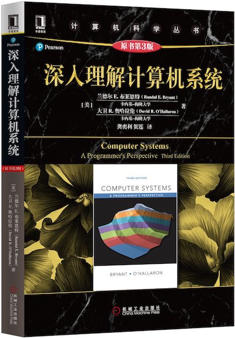

## Computer Systems: A Programmer's Perspective

### 1. Prepare

- C程序设计语言：[原书PDF(英文)](./_Attachments/The_C_Programming_Language_2.pdf) [原书PDF(中文)](./_Attachments/The_C_Programming_Language_2_ch.pdf)

### 2. Classes

- [计算机系统基础（一）：程序的表示、转换与链接](http://www.icourse163.org/course/NJU-1001625001)
- [计算机系统基础（二）：程序的执行和存储访问](http://www.icourse163.org/course/NJU-1001964032)
- [计算机系统基础（三）：异常、中断和输入/输出](http://www.icourse163.org/course/NJU-1002532004)
- [2015 CMU 15-213 CSAPP英文字幕](https://www.bilibili.com/video/av40238125)
- [2015 CMU 15-213 CSAPP中英文字幕](https://www.bilibili.com/video/av31289365)

### 3. References

- 原书PDF版(英文): [Computer Systems: A Programmer's Perspective(3rd)](./_Attachments/Computer_Systems_A_Programmers_Perspective(3rd).pdf)
- [CSAPP(3rd): Solutions](https://github.com/DreamAndDead/CSAPP-3e-Solutions)
- [CSAPP(3rd): Labs](http://csapp.cs.cmu.edu/3e/labs.html)
- [读薄/读厚 CSAPP](https://wdxtub.com/work/)
- [CMU: Introduction to Computer Systems](https://www.cs.cmu.edu/~213/)

### 4. Notes

### 5. Labs

