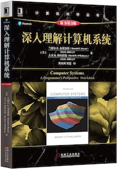
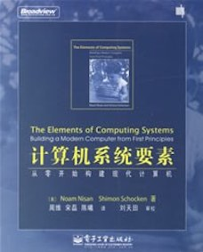
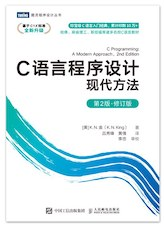
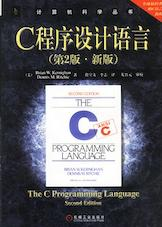
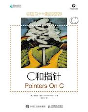
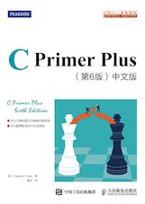
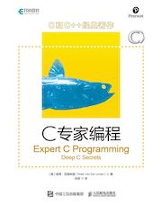

## 深入理解计算机系统 Computer Systems: A Programmer's Perspective

**计算机系统结构**，也称『计算机系统』或『计算机组成』，是了解软件底层的重要视角，如果对计算机如何工作没有具体的概念，那么你所做出的所有高级抽象都是空中楼阁。学习计算机系统的最佳入门书是**[深入理解计算机系统](https://book.douban.com/subject/27000879/)**。

如果你既想了解计算机系统又想兼顾软硬件知识，可以从**[计算机系统要素](https://book.douban.com/subject/1998341/)**这本书开始，又名『从与非门到俄罗斯方块(_Nand2Tetris_)』。它从用 HDL 写基本的逻辑门电路开始，途径 CPU、汇编，最终抵达诸如俄罗斯方块这样规模的应用程序，可以让我们对计算机内的所有部分如何协同工作有完全的认识。不过这本书没有涉及流水线和存储层次结构（现代计算机体系结构中最重要的两个概念），我们最终还是要回到 CSAPP 这本书。

学习 Nand2Tetris 时，可以结合 Coursera 上的课程[从第一原理构建现代计算机](https://www.coursera.org/learn/build-a-computer)。学习 CSAPP 时，可以结合 [CMU 15-213](https://www.cs.cmu.edu/~213/) 和 [CS61C](http://inst.eecs.berkeley.edu/~cs61c/sp15/)。

 

### 1. C语言

推荐**[C语言程序设计：现代方法](https://book.douban.com/subject/35503091/)**。

   

 

- C程序设计语言：[原书PDF(英文)](./_Attachments/The_C_Programming_Language_2.pdf) [原书PDF(中文)](./_Attachments/The_C_Programming_Language_2_ch.pdf)

### 2. Classes

- [计算机系统基础（一）：程序的表示、转换与链接](http://www.icourse163.org/course/NJU-1001625001)
- [计算机系统基础（二）：程序的执行和存储访问](http://www.icourse163.org/course/NJU-1001964032)
- [计算机系统基础（三）：异常、中断和输入/输出](http://www.icourse163.org/course/NJU-1002532004)
- [2015 CMU 15-213 CSAPP英文字幕](https://www.bilibili.com/video/av40238125)
- [2015 CMU 15-213 CSAPP中英文字幕](https://www.bilibili.com/video/av31289365)

### 3. References

- 原书PDF版(英文): [Computer Systems: A Programmer's Perspective(3rd)](./_Attachments/Computer_Systems_A_Programmers_Perspective(3rd).pdf)
- [CSAPP(3rd): Solutions](https://github.com/DreamAndDead/CSAPP-3e-Solutions)
- [CSAPP(3rd): Labs](http://csapp.cs.cmu.edu/3e/labs.html)
- [读薄/读厚 CSAPP](https://wdxtub.com/work/)
- [CMU: Introduction to Computer Systems](https://www.cs.cmu.edu/~213/)

### 4. Notes

### 5. Labs

### Resources

#### C语言

#### CSAPP

https://www.nand2tetris.org/

https://www.coursera.org/learn/build-a-computer

